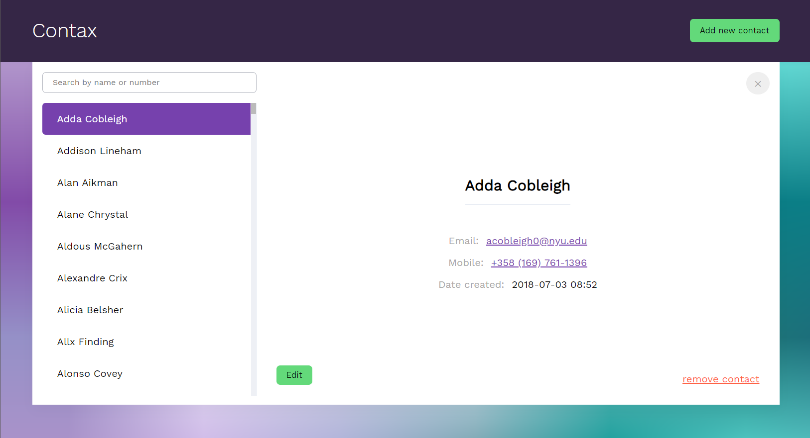

# Contax

A take home assignment for managing contacts.

## Running it locally

The project can simply be run with the following NPM script:

```
npm install
npm start
```

It will launch the react app in the browser and a fake server loading contents from `data/contacts.json`

## Tests

Components are tested, run them with:

```
npm start
```

## Tech stuff

- Optimized for mobile
- No CSS framework is used
- React / Redux based
- Test framework: Jest / Enzyme

## Design

After creating wireframes for the app on pen and paper, I looked at some projects designers came up with. Take a look at them in the `design-inspiration` folder.

